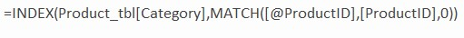
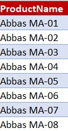
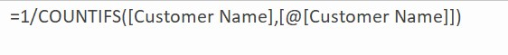
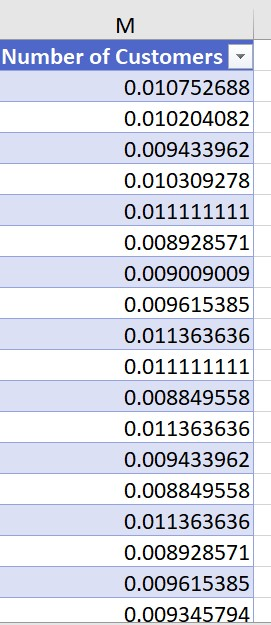
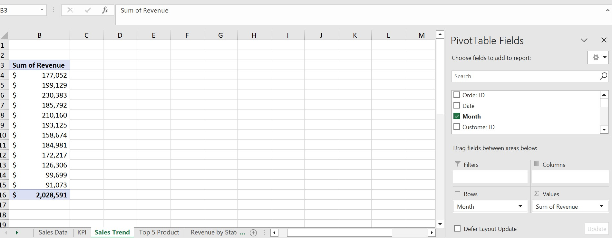

# Sales-Analysis-Using-Excel

This is a sales analysis using Microsoft Excel. The data was gotten from quantum analytics and was used to create a dashboard that answers Business related questions asked by stakeholders. The Excel file contains several sheet to different data's.

#Problem Statement 

The aim of this analysis is to answer the following Business related questions

- What month generated the highest revenue?
- In what month did the company make the highest sales? 
- what product generated the highest revenue?
- Who was the highest sales person between 2018 and 2019?
- What region generated the highest revenue?

# Skills & Concept used:

- Index match. This is very similar joins used in SQL to integrate data from various sources together. 
- Data Manipulation & Transformation
- Pivot table
- Pivot chart
- Excel functions

# Data Integration (Index Match)
I was able to merge the various data coming from different sources using the index match function as shown below:

This was the result as shown below

# Data Manipulation & Transformation

Part of the manipulation I did was to create a column that counts the number of customers. By default, Excel does not have an inbuilt function to a distinct count like in Power Bi using DAX, hence had to use an alternative method. This method entails breaking down the counts into fractions similar to dividing an orange into 4 quarters/fractions and then summing up the 4quarters to get a single whole orange. Below is the the Excel function i used in achieving this

Below is the end result

A sum of all the fractions will yield the total number of customers.

# Pivot Table

Pivot Table was used to generate the KPI cards used in the final dashboard to stakeholders.

