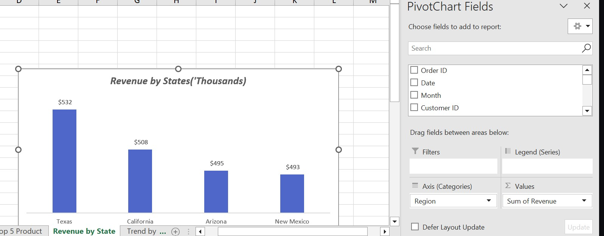

# Sales-Analysis-Using-Excel

This is a sales analysis using Microsoft Excel. The data was gotten from quantum analytics and was used to create a dashboard that answers Business related questions asked by stakeholders. The Excel file contains several sheet to different data's.

#Problem Statement 

The aim of this analysis is to answer the following Business related questions

- What month generated the highest revenue?
- In what month did the company make the highest sales? 
- What product generated the highest revenue?
- Who are the top 5 sales person in the company?
- What region generated the highest revenue?

# Skills & Concept used:

- Index match. This is very similar joins used in SQL to integrate data from various sources together. 
- Data Manipulation & Transformation
- Pivot table
- Pivot chart
- Excel functions

# Data Integration (Index Match)
I was able to merge the various data coming from different sources using the index match function as shown below:

This was the result as shown below

# Data Manipulation & Transformation

Part of the manipulation I did was to create a column that counts the number of customers. By default, Excel does not have an inbuilt function to a distinct count like in Power Bi using DAX, hence had to use an alternative method. This method entails breaking down the counts into fractions similar to dividing an orange into 4 quarters/fractions and then summing up the 4quarters to get a single whole orange. Below is the the Excel function i used in achieving this

Below is the end result

A sum of all the fractions will yield the total number of customers.

# Pivot Table

Pivot Table was used to generate the KPI cards used in the final dashboard to stakeholders.

# Pivot Chart

Similary different pivot charts were created on separate sheets and were then used in the final dashboard sheet.

# Data Visualization

The visuals used consisted of cards to show different KPI'S, clustered column  & bar chart to show revenue by products & quantity of products sold by sales person, line chart to show sales trend by month & quantity of ggods sold by month, pie chart to show revenue generated by region and slicers by region. The slicers used are to make the dashboard an interactive one so as to answer different business problems based on the data presented. Below is the dashboard

# Insights:

- The month of march genertaed the highest revenue (*$210,000*).
- The month of may generated the highest number of sales as the quantity ordered was *1050*. 
- Item 1 generated the highest revenue with *$737,000*.
- Anna Weber was the top sales person selling 1,232 products as compared to others.
- Texas generated the highest revenue contribution with about *26.23%* followed by california with about *25.05%*.

# Recommendation

- There should be focus on maximizing revenue in March by analyzing the sales and marketing activities, product offerings, pricing, and customer behavior during that month to identify any patterns or successful tactics that can be replicated in other months.
- Texas and California contributed the highest revenue percentages (26.23% and 25.05%, respectively). Allocate additional resources, marketing efforts, and sales support to these regions to maintain their strong performance and capture further market share.
- December generated the least revenue, indicating potential challenges or factors affecting sales during that period. Analyze market dynamics, customer behavior, and any specific limitations or constraints faced in December to identify improvement opportunities for future December sales.
-  Item 3 generated the lowest revenue of $125,000. Evaluate the factors influencing its performance, such as pricing, customer demand, or market competition. Consider strategies to increase its sales, such as targeted marketing campaigns, product positioning, or adjustments to pricing and packaging.
-  Anna Weber stands out as the top salesperson, selling 1,232 products compared to others. Acknowledge Anna's exceptional performance and consider implementing recognition programs or incentives to motivate other sales team members and encourage healthy competition.

